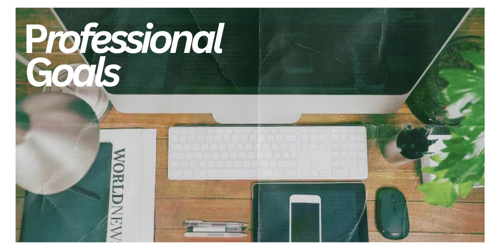

# Professional Goals

Five years after graduating, I want to have built a strong career in user experience design and research. I hope to be working as a UX designer or researcher where I can combine creativity, research, and problem-solving to create digital experiences that are useful and enjoyable for people.

I also want to have developed a strong portfolio filled with projects that show how I have grown as a designer. I would like to have experience working with different teams and clients and feel confident using tools such as Figma, Photoshop, and other design software.

Most importantly, I want to be in a position where I am still learning and improving. I do not expect to know exactly where my career will take me, but I want to look back at university and see that it gave me the foundation to build a career that I genuinely enjoy.