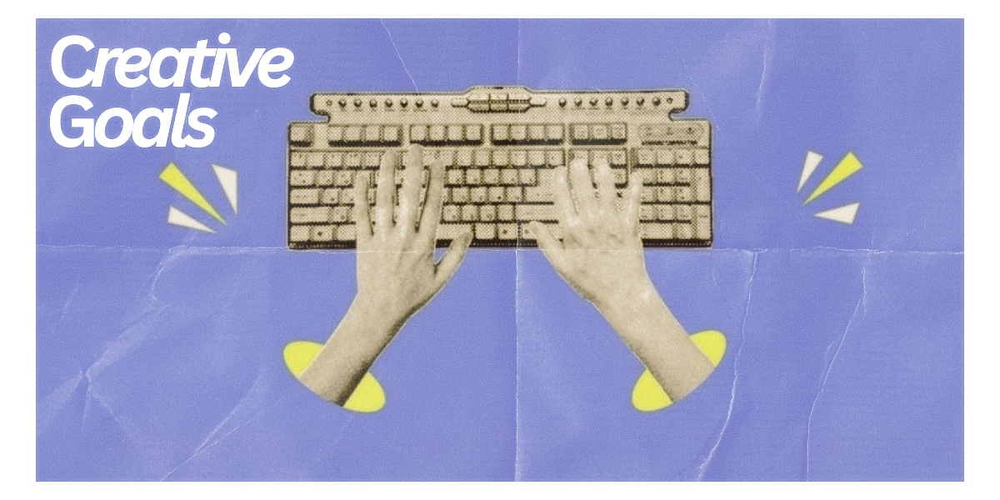

# Creative Goals

Five years after graduating, I want creativity to still be an important part of my life. Alongside my career in UX design, I want to continue developing my skills in graphic design and photography and explore new ways of expressing my ideas.

I hope to have built a collection of creative work that feels personal to me rather than creating only for school or work. I would like to work on projects involving photography, visual design, branding, and other areas that allow me to experiment with different styles and ideas.

I also want to continue learning new creative tools and techniques. My goal is to be able to look back at the work I created in university and see how much my style and abilities have developed over those five years.