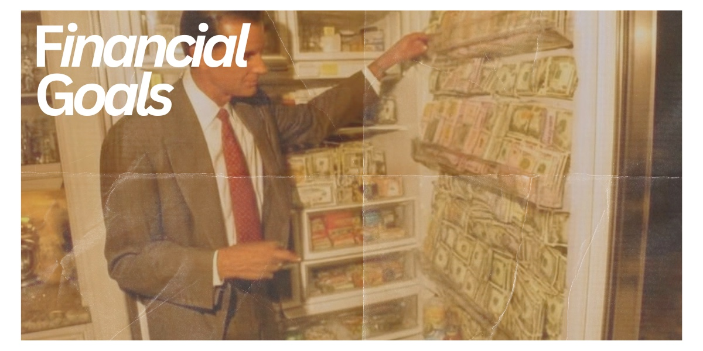

# Financial Goals

Five years after graduating, I want to be financially independent and comfortable supporting myself. I want to have a stable income from my career and be able to manage my expenses without constantly worrying about money.

I also want to have built a consistent habit of saving money. Whether it is for travel, a future home, emergencies, or other major goals, I want to be responsible with what I earn while still being able to enjoy my life.

Another goal is to understand my finances better than I do today. I want to be confident with budgeting, saving, and planning for my future so that I can make financial decisions independently.