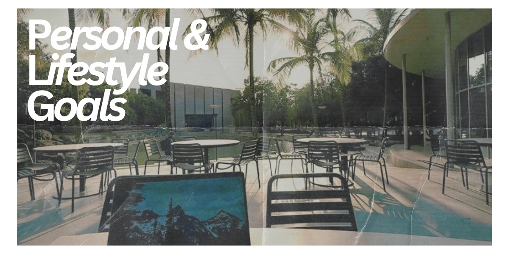

# Personal & Lifestyle Goals

Five years after graduating, I want to have created a life that gives me a good balance between my career and my personal interests. I want to have the freedom to travel, experience new places, and continue meeting people from different backgrounds.

I also hope to have built a comfortable home and a strong community around me. While my career is important, I do not want work to become my entire life. I want to make time for my friends, family, hobbies, and the experiences that are important to me.

Overall, I want to feel more confident and independent than I do today. I know that my plans may change over the next five years, but I want to be able to look back and feel proud of the life and relationships I have built for myself.